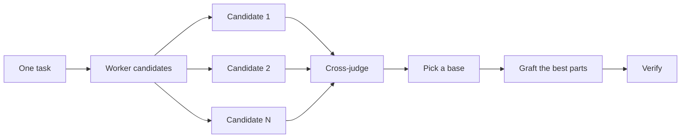

# Design before you write code

One attempt at a hard design locks in the first shape the model thought of. `/architect` settles types and boundaries before implementation. `/arena` gathers read-only design proposals for the same brief and merges the best ideas. `/interrogate` has one Astra xhigh Judge try to break the result. When the job is coverage rather than design synthesis, `/swarm` fans out slices or races and aggregates their results.


## Settle the shape with `/architect`

```text
/architect design the import pipeline before writing any code. i care most about how callers use it.
```

[`/architect`](../../skills/architect/SKILL.md) grounds itself first, running `/how` over the code the design touches and `/why` when it moves ownership or layers. Then it runs `/arena` to produce competing design sketches, with the caller's usage written first in each, followed by types, signatures, and a module map.

When implementation is in scope, the parent proceeds straight from the synthesized design into implementation. For design-only requests, it returns the design and stops. If you want to see the design first, say so:

```text
/architect with checkpoint. stop and show me before implementing.
```

## Fan out attempts with `/arena`

```text
/arena take my prompt to the arena verbatim. i want to compare their proposals with yours.
```

[`/arena`](../../skills/arena/SKILL.md) is the general tool underneath. N read-only subagents inspect the same design brief in parallel and return proposals with code sketches as text. They do not edit files or implement changes. A read-only judge, always on Astra xhigh, scores every candidate against a rubric. The coordinator reads each candidate end to end, picks a base, grafts in the best ideas from the losers, and checks the design against the source and constraints. The parent owns any later implementation.



Candidates use the Worker profile from [`/setup-pstack`](../../skills/setup-pstack/SKILL.md). Request more or fewer candidates per task; three is the default:

```text
/arena this, 5 candidates. the cache key format is expensive to change later.
```

## Cover slices and races with `/swarm`

```text
/swarm check every package under packages/ against its check.sh. one worker per package. one report.
```

[`/swarm`](../../skills/swarm/SKILL.md) fans N workers across independent slices, coverage matrices, gauntlet lanes, exploration partitions, or declared race arms. Each worker gets its own scope and check, then reports `PASS`, `ISSUES`, or `BLOCKED`. The parent waits for the workers and returns one compact report with any gaps or dropouts.

Reach for it when parallelism buys coverage or lets independent checks race. `/arena` gives every worker the same design brief, then picks a base and grafts the best parts. `/swarm` covers slices or runs a race with a selection rule declared up front. It does not use the base-selection and grafting ceremony.

## Break it with `/interrogate`

```text
/interrogate the whole branch, but skeptically. no nitpicks unless it's an actual bug or regression.
```

[`/interrogate`](../../skills/interrogate/SKILL.md) sends the diff, intent, and rubric to one independent Astra xhigh Judge. The lead verifies findings against the code and sorts them into `Act on`, `Consider`, `Noted`, and `Dismissed`, with evidence and a reason for each dismissal. It applies nothing automatically.

Read the dismissals too. The lead is a pragmatic senior engineer, not an oracle, and you can override it.

## How much design work does a task deserve?

You might be wondering whether every change needs this. No. Most changes need none of it. A rough ladder:

- A small, finished change you're unsure about needs `/interrogate` alone.
- A change that crosses function boundaries or moves ownership earns `/architect`, which brings `/arena` with it.
- A standalone decision where independent attempts would help, like naming, formats, or an algorithm, is `/arena` directly.
- A coverage matrix, set of parallel checks, or race with declared arms is `/swarm`.
- A contested design that's expensive to reverse gets `/architect`, then `/interrogate` before shipping.

`/poteto-mode` already applies this ladder. Boundary-crossing work triggers `/architect` on its own, so you reach for these directly mainly when you want more or less scrutiny than the default.

Next: [Build and clean the change](./05-build-and-clean.md).
